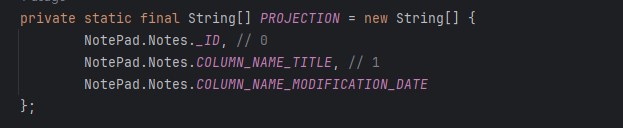
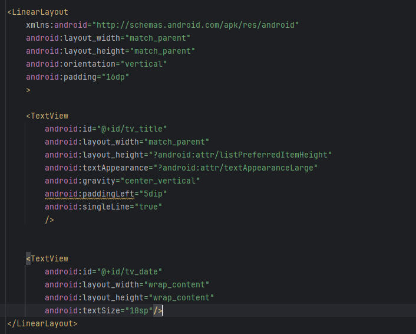
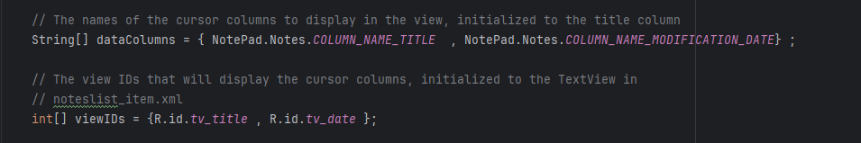
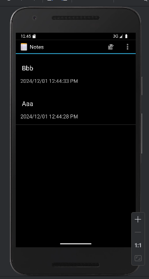
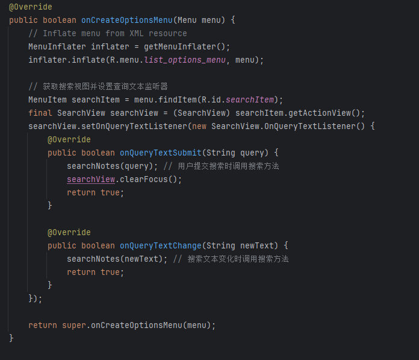
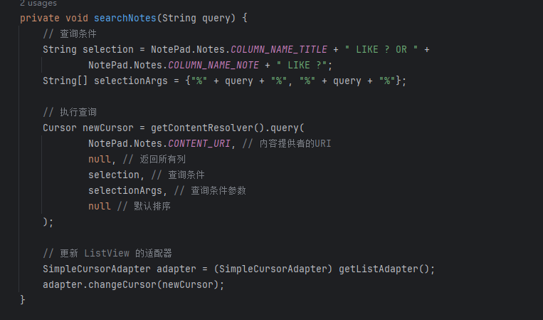
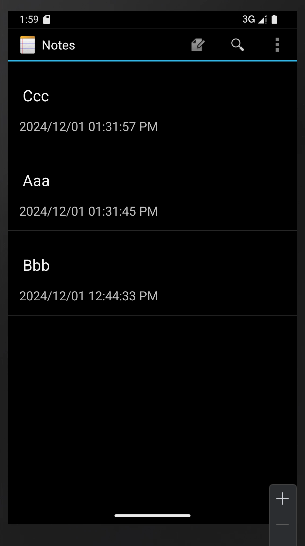
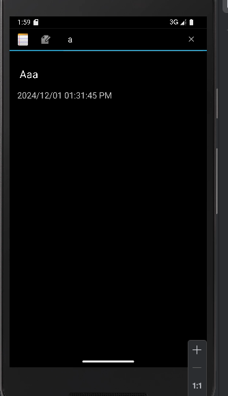
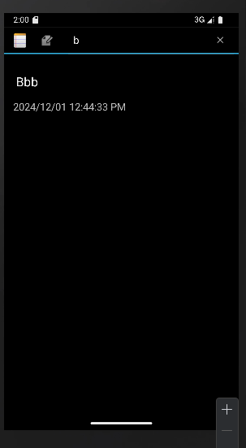

基本功能实现：
（一）笔记列表显示笔记条目的时间戳
1.在PROJECTION投影中添加NotePad.Notes.COLUMN_NAME_MODIFICATION_DATE

2.修改对应布局文件以显示时间戳

3.修改NoteList.java中对应字段

4.更改SimpleCursorAdapter中数据显示格式

5.完成时间戳显示功能

（二）笔记内容的搜索功能
1.在list_options_menu.xml中添加搜索框

2.重写onCreateOptionsMenu方法，加载菜单资源，并为搜索视图设置监听器。

3.使用搜索结果创建一个新的Cursor，然后更新ListView。

4.完成搜素功能

