基本功能实现：
（一）笔记列表显示笔记条目的时间戳
1.在PROJECTION投影中添加NotePad.Notes.COLUMN_NAME_MODIFICATION_DATE

2.修改对应布局文件以显示时间戳

3.修改NoteList.java中对应字段

4.更改SimpleCursorAdapter中数据显示格式

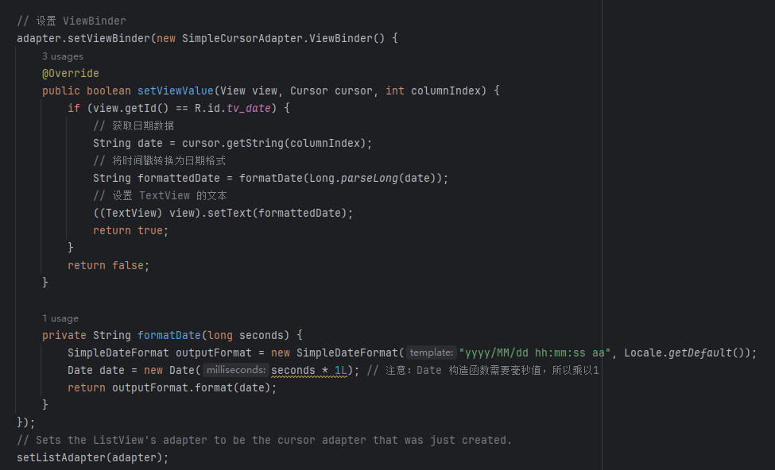

5.完成时间戳显示功能

（二）笔记内容的搜索功能

1.在list_options_menu.xml中添加搜索框

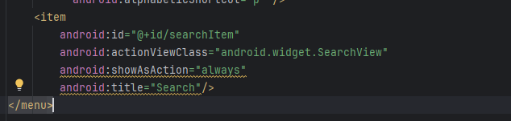

2.重写onCreateOptionsMenu方法，加载菜单资源，并为搜索视图设置监听器。

3.使用搜索结果创建一个新的Cursor，然后更新ListView。

4.完成搜素功能

扩展功能实现：
（一）一键清空所有笔记功能
1.在 onCreateOptionsMenu 方法中添加一个新的菜单项

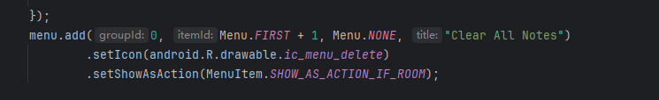

2.在 onOptionsItemSelected 方法中处理新的菜单项点击事件

3.实现clearAllNotes方法

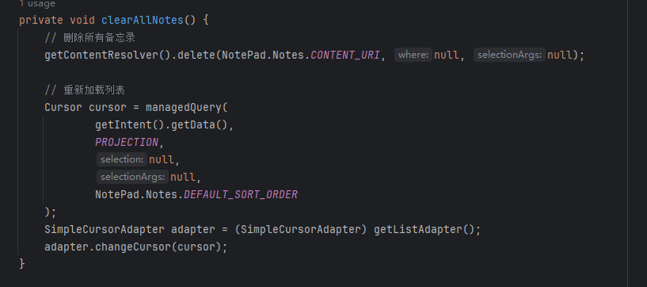

4.一键清空所有笔记功能演示

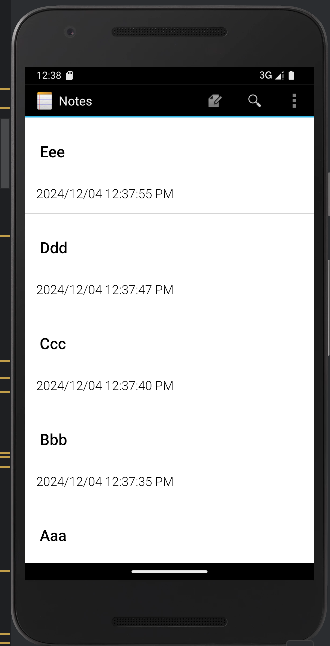
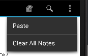

（二）将笔记按首字母排序功能

1.在list_options_menu.xml中添加按首字母排序

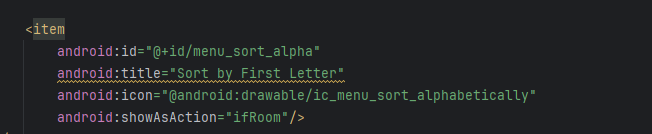

2.在onOptionsItemSelected方法中处理新的排序菜单项

3.实现sortNotesByFirstLetter方法

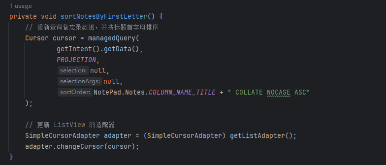

4.将笔记按首字母排序功能演示

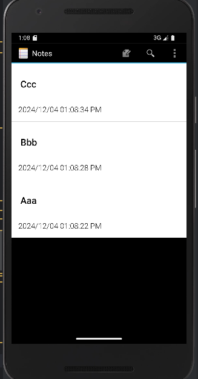
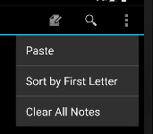
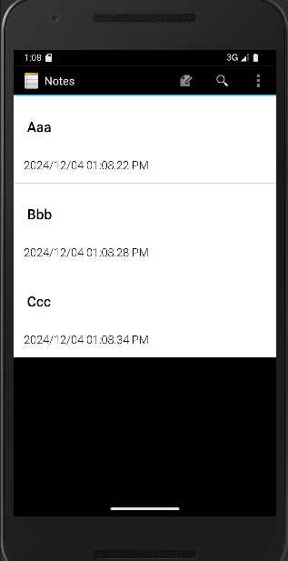